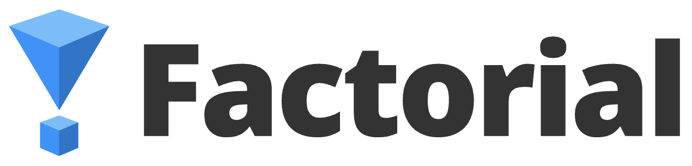

## Hello, here is Factorial❕ 👋👋👋

<!--

**Here are some ideas to get you started:**

🙋‍♀️ A short introduction - what is your organization all about?
🌈 Contribution guidelines - how can the community get involved?
👩‍💻 Useful resources - where can the community find your docs? Is there anything else the community should know?
🍿 Fun facts - what does your team eat for breakfast?
🧙 Remember, you can do mighty things with the power of [Markdown](https://docs.github.com/github/writing-on-github/getting-started-with-writing-and-formatting-on-github/basic-writing-and-formatting-syntax)
-->

We are buidling a DeFi infrastructure called `Factorial`, which is introduced in BUIDLathon of ETHDenver2023.
Factorial is a smart contract framework for DeFi builders.
Factorial enables the DeFi builders to focus on their own key idea.

Visit the [core repository of Factorial](https://github.com/factorial-eth-denver/factorial-contract).

Check it out more about `Factorial`!

- [Website](https://factorial-1.gitbook.io/factorial) 
- [Docs](https://factorial-1.gitbook.io/factorial)
- [YouTube](https://www.youtube.com/channel/UC8s9PaQbGHehm5dtU_sOJdQ)
- [Twitter](https://twitter.com/FactorialFi)
- [Telegram](https://t.me/factorialfi)
- [Discord](https://discord.gg/zggTQdDtZM)

If you have any feedback&comment, please visit [Feedback](https://airtable.com/shrI1qTxflZLGLmMK) to leave your thought.
